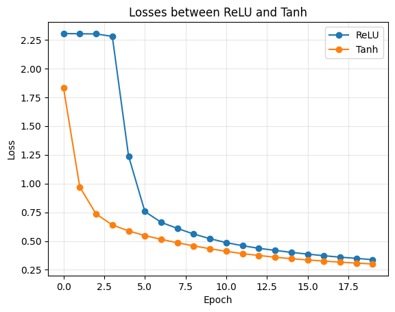

## 1. Problem and Motivation
In this project, I am investigating the dependency between Pixel Normalization and Activation Function performance in CNNs. Specifically, how different input scales (like [-1, 1] vs [-5, 5]) affect the competition between ReLU and Tanh. This is interesting because in common practice, ReLU is almost always treated as the default choice. We rarely question if its superiority holds under all data preprocessing conditions. However, my project reveals that preprocessing is not just a cleaning step—it also fundamentally changes the model dynamics. Investigating this link is crucial because it challenges the "one-size-fits-all" mindset and highlights the importance of matching normalization strategy to network architecture.

## 2. Hypothesis
Initially, I hypothesized that ReLU would simply outperform Tanh across the board. However, my preliminary experiments unexpectedly showed Tanh performing better on standard normalized data. This observation led to my refined hypothesis: The performance gap depends critically on the input magnitude. Specifically, I hypothesize that Tanh is superior when pixel values are confined to a narrow range near zero (e.g., [-1, 1]), whereas ReLU becomes more effective only when the input distribution is more dispersed (e.g., [-5, 5]).
If my results show high accuracy for Tanh on small scales and high accuracy for ReLU on large scales, this hypothesis will be supported.

## 3. Experimental Design
In this study, I employ a CNN architecture comprising five convolutional layers and three fully-connected layers to classify the FashionMNIST dataset. I have established two distinct normalization environments: a narrow range setup ([-1, 1]) and a wide range setup ([-5, 5]). To maintain experimental control, only the pixel normalization range and the type of activation function are varied, while all other hyperparameters remain constant. This design is sufficient to test my hypothesis as it isolates input magnitude as the sole variable impacting activation function performance. By observing the performance disparities between the two activation functions across different pixel ranges, I can directly attribute any variance in efficacy to the input scale, thereby confirming or refuting the hypothesis.

## 4. Results
### 4.1 Narrow Range Case ([-1, 1])
The following figure illustrates the loss comparison under the narrow-range normalization:

Test set accuracies:

| Activation | Accuracy |
|------------|----------|
| ReLU       | 86.62%   |
| Tanh       | 88.56%   |

As illustrated in the figure, under the narrow range setup, the model utilizing Tanh exhibits a rapid decline in loss during the initial epochs. In contrast, the loss for the ReLU-based model remains nearly stagnant throughout the first four epochs, staying consistently high at a level near ln(10), which represents the theoretical cross-entropy loss for a 10-class classification task under random guessing conditions. During the subsequent training process, the loss of the ReLU-based model remains consistently higher than that of its Tanh counterpart. Ultimately, its accuracy on the test set is approximately two percentage points lower than that of the Tanh-based model.

### 4.2 Wide Range Case ([-5, 5])
In contrast, when the pixel values are expanded to a wider range ([-5, 5]), the results shift:

Test set accuracies:

| Activation | Accuracy |
|------------|----------|
| ReLU       | 89.84%   |
| Tanh       | 89.12%   |

Conversely, in the wide-range setup, although the loss for the ReLU-based model remains remarkably high in the first epoch (closely approaching ln(10)), it undergoes a rapid decline in subsequent epochs. By the end of the training process, the ReLU-based model achieves a lower loss compared to its Tanh counterpart. Furthermore, the model utilizing ReLU demonstrates superior performance in terms of test set accuracy, outperforming the Tanh-based model by 0.72 percentage points.

## 5. Analysis
If we fix the pixel value range, then the only variable is the activation function, I believe that capturing the distribution of pre-activation values is effective in explaining this phenomenon, which leads to the following analysis.

### Figure of violin plots of pre-activation value in small range setup
This figure visualizes the evolution of pre-activation value distributions for ReLU and Tanh models across different epochs and network layers when pixel values ∈ [-1,1] using violin plots, where the width of each plot represents the data density at a given value, and two horizontal lines in the figure represent the median and the mean.
The charts are arranged row by row according to network layers where each individual violin plot corresponds to the distribution of a specific model with activation function either Tanh or ReLU at a specific layer and epoch. We juxtaposed the distributions of different pre-activation values within the same layer and epoch to facilitate a direct comparison of their behavior at any given moment.
The plots on one row is divided into two distinct sections: the first 5 epochs and the subsequent 15 epochs. This design addresses the issue of relatively small pre-activation value amplitudes during early training. By isolating the initial phase, we prevent subtle numerical variations from being overshadowed by the larger value ranges observed in later stages, thereby clearly revealing the internal dynamics during the model's startup phase.

### Analysis of the phenomenon in small range setup
From the pre-activation distribution plots, we observe that under the narrow range setup, the absolute values of pre-activation remain small and concentrated near zero, with roughly half positive and half negative. This favors Tanh because its gradient reaches its maximum (approaching 1) near x=0, enabling efficient gradient descent. Additionally, Tanh provides non-zero gradients for both positive and negative values.

In contrast, ReLU suffers from the dying neuron problem: during the first four epochs, across almost all layers, half or more of the pre-activation values are negative. Since ReLU outputs zero gradient for negative inputs, weight updates become extremely slow. It is not until the fifth epoch and beyond that the majority of pre-activation values in ReLU-based models shift to positive. This explains why the loss remains stagnant near ln(10) during the initial epochs.

### Figure of violin plots of pre-activation value in large range setup
This figure is organized in the same way as the previous one, but it represents the case where the pixel value range ∈ [-5, 5].

### Analysis of the phenomenon in large range setup
When the input range expands, the pre-activation distribution shifts further away from zero. As shown in the plots, for the ReLU-based model, only the first epoch exhibits roughly half positive and half negative pre-activation values across layers. From the second epoch onward, the majority of pre-activation values become positive across all layers, enabling rapid loss descent starting from the second epoch.

In contrast, Tanh gradually suffers from saturation: when |x| > 2, its output approaches ±1 and the gradient diminishes toward zero. This gradient saturation slows down Tanh's convergence, allowing ReLU to outperform.

## 6. Conclusion / Teaching Moment

### What did we learn?
Activation function selection should not be made independently of data preprocessing. The relative performance of ReLU and Tanh depends on input magnitude. If the input range is narrow, then Tanh works better since it leverages strong gradients near zero. If input range is wide, then ReLU works better since it avoids the dying neuron problem.

### What misconception does this clarify?
A common belief is that ReLU is always better than Tanh. This experiment shows that ReLU's advantage relies on the input distribution being sufficiently positive. When inputs are close to zero, ReLU may underperform due to dying neurons.

### What would change if assumptions were violated?
If LeakyReLU were used, the dying neuron problem would be mitigated, reducing ReLU's disadvantage in narrow-range scenarios.

## 7. Limitations
- In this experiment, only two activation functions (ReLU and Tanh) were tested; other choices such as LeakyReLU were not explored. 
- The dataset of this experiment is also limited to FashionMNIST; the findings may not generalize to other datasets with different input distributions.