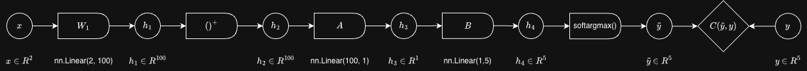
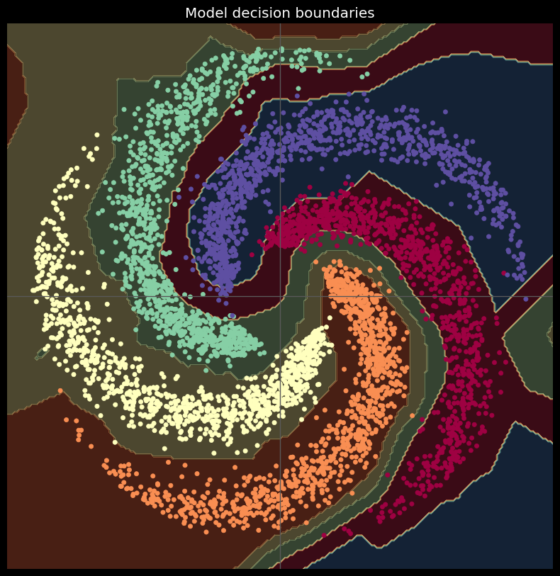
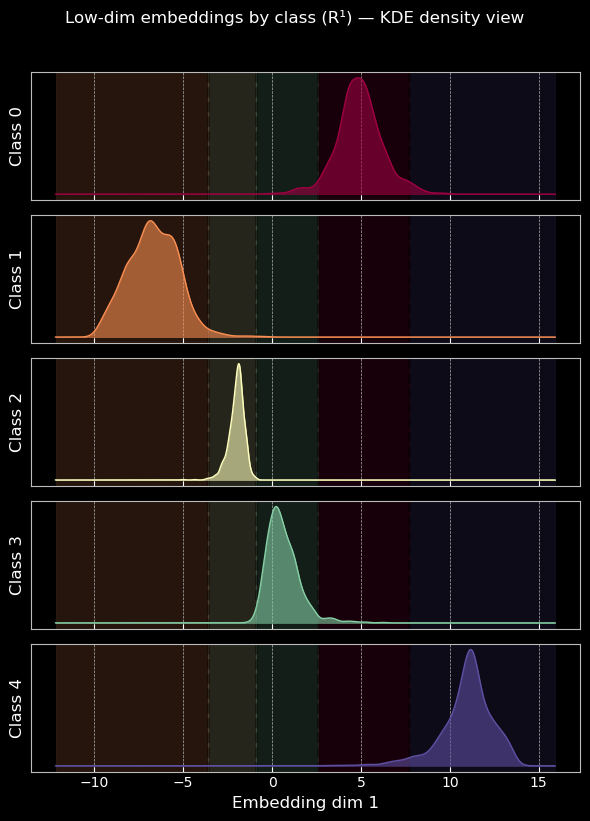
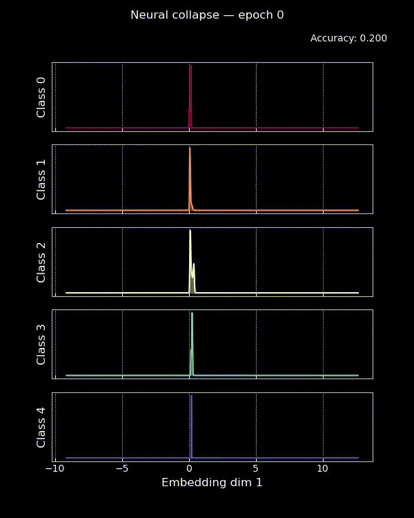
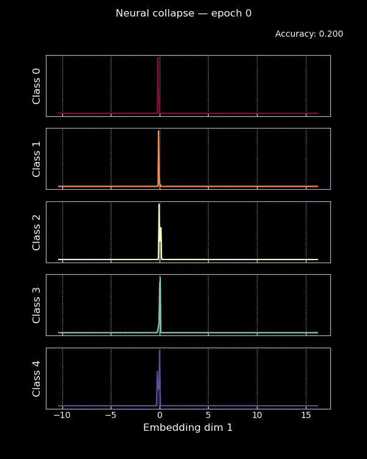

## 1. Problem and Motivation

From the spiral classification [`notebook`](https://github.com/Atcold/NYU-DLSP21/blob/master/04-spiral_classification.ipynb) in the course repository, we know a 2-layer neural network can perform well on the spiral classification task. It also performs well when we limit the final linear layer to be rank-2. We further modify it to rank-1 to see if it still works, and we visualize the representations in the one-dimensional bottleneck layer during training.

---

## 2. Hypothesis

Even with a rank-1 bottleneck before the final classifier, the network can still reach high accuracy on the spiral task, since the "heavy work" is done by the first hidden layer with 100 dimensions.

---

## 3. Experimental Design

We use the same spiral dataset as in the base notebook, with five classes and two-dimensional inputs. The neural network consists of one hidden layer with 100 neurons and ReLU activation. Instead of mapping directly from the hidden layer to the five output logits, we factor the final layer into two linear layers: `Linear(d, 1)` followed by `Linear(1, 5)`.

Model architecture:  

Training is performed using full-batch Adam optimization with cross-entropy cost, and we train for a large number of iterations to observe long training behavior. We record snapshots of the bottleneck embeddings during training and use **kernel density estimation** to visualize how the one-dimensional representations for each class evolve over time.

---

## 4. Results

With the rank-1 bottleneck, the model reaches about 97% accuracy. This is almost the same as the rank-2 bottleneck result (0.995). The classifier still learns meaningful class separation, although some edge points are hard to classify for the network.

Visualizing the one-dimensional embeddings shows that samples from different classes occupy different regions on the line, and decision boundaries lie between these regions. Kernel density plots reveal that, over time, the distributions for each class become narrower and approach a Dirac delta.

The animation shows that early in training, class embeddings are highly overlapping, but as training continues, each class forms a tighter cluster and the overlap decreases. We also observe that as we increase the number of epochs, samples from the same class gradually move closer together in the one-dimensional bottleneck representation, forming compact clusters that align with the classifier’s decision regions.

If we set the learning rate to `1e-3`, the final class distributions gradually approach a Dirac delta for each class, and accuracy steadily increases to about 0.966. If we set the learning rate to `1e-2`, the class distributions oscillate between being close to a Dirac delta and spreading out again, and the accuracy reaches as high as 0.98 but occasionally drops to around 0.5 before increasing again.

Learning rate `1e-3`:

Learning rate `1e-2`:

---

## 5. Analysis

The results suggest that even under a strong rank constraint, the network is still able to organize samples from the same class into compact regions in the bottleneck space. Since only a single scalar is available to represent each sample, the network effectively orders the classes along a line and places decision boundaries between these ordered regions.

Also, the network prioritizes reducing within-class variation once classification becomes reliable. A lower learning rate makes this reduction more stable. This phenomenon corresponds to what is known as within-class feature collapse, which is one component of neural collapse. In this regime, cross-entropy loss continues to decrease long after the classification error is already zero during the terminal phase of training (TPT), and cross-example within-class variability of last-layer activations collapses to zero as individual activations collapse to their class means (Papyan et al., 2020).

---

## 6. Conclusion

This experiment shows that forcing a network to use only a single-dimensional internal representation does not prevent it from learning useful class structure on a simple nonlinear task. Instead, the network adapts by compressing each class into a narrow region and arranging those regions along the available dimension. This phenomenon emerges gradually during optimization rather than appearing suddenly at convergence. Even though final accuracy is slightly lower than in higher-rank settings, the internal representation is highly structured.

---

## 7. Limitations

This experiment is limited to a synthetic dataset and a shallow network, so the behavior may not generalize to more complex architectures or real-world data.

In the neural collapse framework (Papyan et al., 2020), our visualization only corresponds to NC1, which states that each class collapses to a single point. NC2 describes how the five class means form a 4-simplex, which in our case degenerates, and requires a feature dimension of at least 4 to observe. The paper also analyzes the weights of the final classification matrix in NC3 and NC4, which are not studied here.

---

## References

Papyan, V., Han, X., & Donoho, D. (2020). *Prevalence of neural collapse during the terminal phase of deep learning training*. PNAS. https://www.pnas.org/doi/10.1073/pnas.2015509117
